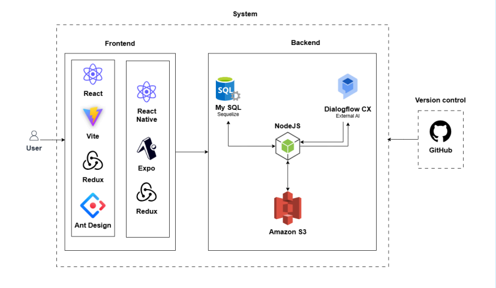
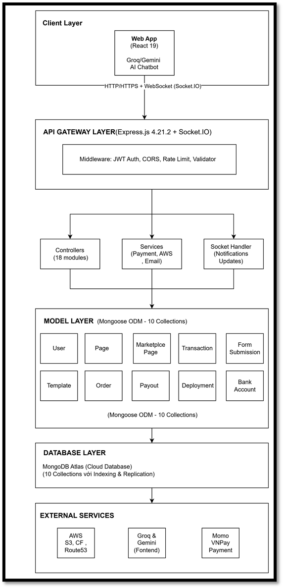

# Landing Hub — Nền tảng Tạo & Phân phối Landing Page tích hợp AI

> **Dự án Khóa luận Tốt nghiệp** · Kỹ thuật Phần mềm · Trường Đại học Công nghiệp TP.HCM  
> **GVHD:** ThS. Trần Thế Trung

---

## Giới thiệu

**Landing Hub** là một nền tảng SaaS đa nền tảng cho phép người dùng **tạo, triển khai và kinh doanh landing page** mà không cần biết lập trình.

Trong bối cảnh chuyển đổi số, các doanh nghiệp cần landing page chuyên nghiệp để tăng tỷ lệ chuyển đổi khách hàng — nhưng chi phí thuê developer và thời gian triển khai là rào cản lớn. Landing Hub giải quyết bài toán đó bằng cách **tự động hóa toàn bộ quy trình**: từ thiết kế → triển khai → mua bán template → hỗ trợ AI.

---

## 🎯 Kết quả nổi bật

| Chỉ số | Kết quả |
|--------|---------|
| Số người dùng đồng thời | **100 users** |
| Thời gian phản hồi trung bình | **156ms** |
| Tốc độ phản hồi AI (Groq) | **< 100ms** |
| Tốc độ tải trang landing (CDN) | **< 2 giây toàn cầu** |
| Uptime hệ thống AI (fallback) | **99.9%** |
| Thời gian tạo landing page | **Từ nhiều ngày → vài phút** |

---

## ✨ Tính năng chính

### 🖱️ Drag-and-Drop Builder
- Trình tạo trang kéo-thả trực quan dựa trên **GrapesJS**
- Hỗ trợ responsive: Desktop / Tablet / Mobile
- Lưu/tải dự án dưới dạng JSON
- Không cần viết một dòng code

### 🤖 Hệ thống AI Toàn diện
- **AI Content Generation**: Tự động tạo nội dung marketing (heading, button, paragraph)
- **Page Analysis**: Chấm điểm và đề xuất cải thiện landing page
- **Intelligent Chatbot**: Hỗ trợ 24/7 với dữ liệu thời gian thực từ marketplace
- **Auto-Fallback**: Groq (Llama 3.3 70B) → Google Gemini 2.0 Flash khi có lỗi

### 🛒 Marketplace Mua bán Template
- Người dùng đăng bán template landing page của mình
- Quy trình kiểm duyệt bởi Admin
- Tích hợp thanh toán **MoMo** & **VNPay**
- Hoa hồng tự động cho người bán sau 7 ngày (chính sách hoàn tiền)
- Phí nền tảng: 10–15% mỗi giao dịch

### ☁️ Triển khai Tự động (1-Click Deploy)
- Build HTML/CSS/JS tĩnh từ dữ liệu GrapesJS
- Upload lên **AWS S3**
- Phân phối qua **AWS CloudFront** (CDN toàn cầu)
- Tự động cấp **subdomain** và **SSL/HTTPS** miễn phí
- Wildcard DNS qua **AWS Route 53**

---

## 🛠️ Công nghệ sử dụng

### Frontend


### Backend


### Hạ tầng & AI


---

## 🏗️ Kiến trúc hệ thống



**Monorepo Architecture** với `pnpm workspaces` — quản lý đồng thời Web Client, Admin, Mobile App và Backend.

---

## 📊 Luồng nghiệp vụ chính

### Quy trình tạo & triển khai Landing Page
```
Chọn Template → Kéo-thả chỉnh sửa → Lưu (JSON) → Nhập subdomain → Deploy
     ↓                                    ↓                              ↓
 GrapesJS Builder              MongoDB lưu page_data         S3 + CloudFront CDN
                                                          → https://ten.landinghub.shop
```

### Quy trình Marketplace
```
Seller thiết kế → Gửi đăng bán → Admin duyệt → Hiển thị công khai
                                                        ↓
Buyer tìm kiếm → Xem preview → Thanh toán MoMo/VNPay → Webhook xác nhận
                                                        ↓
                                              Tự động cấp quyền sở hữu
```

---

## 📁 Cấu trúc dự án

```
landing-hub/
├── apps/
│   ├── web/          # React 19 - User Web Frontend
│   ├── mobile/           # undeveloped
├── backend/src
│   ├── controllers/     # 23 route controllers
│   ├── services/        # Business logic (AI, Payment, Deploy)
│   ├── models/          # 12 Mongoose schemas
│   └── middleware/      # JWT Auth, Validation
└── package.json         # pnpm workspaces config
```

---

## 🔐 Bảo mật

- Xác thực JWT cho toàn bộ API và WebSocket
- Xác thực chữ ký Webhook từ MoMo/VNPay (chống giả mạo)
- SSL/HTTPS tự động qua AWS Certificate Manager
- Phân quyền nghiêm ngặt: chỉ owner & Admin truy cập `page_data`
- PM2 process manager đảm bảo backend luôn hoạt động

---

## 🧪 Kiểm thử

Hệ thống đã được kiểm thử đầy đủ các luồng nghiệp vụ chính:

- ✅ Đăng ký / Đăng nhập
- ✅ Tạo và lưu Landing Page
- ✅ Đăng bán template (Seller flow)
- ✅ Mua template và xử lý thanh toán (Buyer flow)
- ✅ Triển khai trang lên AWS
- ✅ AI Content Generation & Chatbot

**Performance test**: 100 concurrent users · avg response 156ms (Page Builder)

---

## 🔄 Hướng phát triển tiếp theo

- [ ] A/B Testing & Heatmaps để tối ưu tỷ lệ chuyển đổi (CRO)
- [ ] AI Design Suggestion (tự động đề xuất bố cục theo ngành nghề)
- [ ] Tích hợp thanh toán quốc tế: PayPal, Stripe
- [ ] Hỗ trợ tên miền tùy chỉnh hoàn toàn (custom domain)
- [ ] Quản lý nội dung đa ngôn ngữ

---

## 👨‍💻 Nhóm thực hiện

**Dự án Khóa luận Tốt nghiệp** — Khoa Công nghệ Thông tin  
Trường Đại học Công nghiệp TP. Hồ Chí Minh (IUH)

**GVHD:** ThS. Trần Thế Trung · tranthetrung@iuh.edu.vn

---

## 💡 Liên quan đến vị trí Sales Website

Qua quá trình xây dựng Landing Hub, tôi đã tích lũy được:

- **Hiểu biết thực tế** về Website, Hosting, Domain, SSL, CDN, SEO — từ góc độ xây dựng và vận hành hệ thống thực
- **Kinh nghiệm tư vấn giải pháp số**: phân tích nhu cầu người dùng, thiết kế luồng nghiệp vụ, trình bày sản phẩm
- **Nền tảng kỹ thuật** giúp tư vấn khách hàng chính xác, hiểu vấn đề nhanh, và phối hợp hiệu quả với đội kỹ thuật
- **Tư duy kinh doanh**: thiết kế mô hình doanh thu, phân tích thị trường, xây dựng marketplace

> Tôi hiểu sản phẩm website không chỉ là code — mà là **giải pháp giúp doanh nghiệp tăng doanh thu**. Đó chính xác là góc nhìn tôi mang đến khi tư vấn khách hàng.

---
Document online : 

---
*© 2025 Landing Hub · IUH Software Engineering Capstone Project*